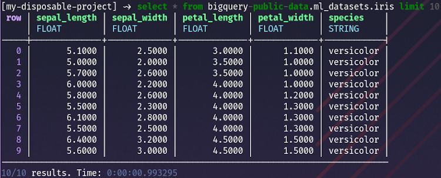
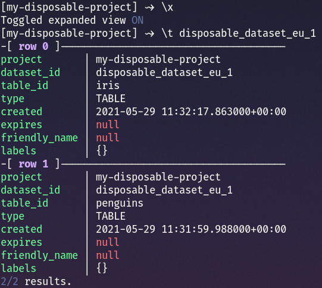
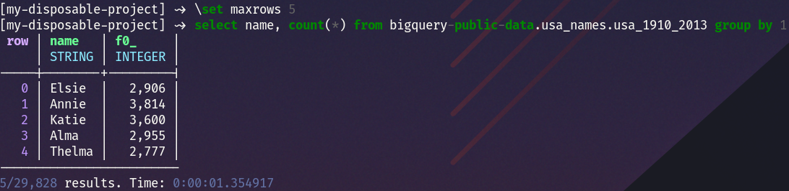

# BQ REPL
REPL for BigQuery







# Commands
```
Commands:
\?, \h, \help                         Print this stuff
\d, \datasets [PROJECT]               List datasets in current project (or another project)
\p, \projects [PROJECT]               List projects
                                      Will switch projects when provided as parameter
\t, \tables [PROJECT.]DATASET         List tables in a dataset
\c, \columns [PROJECT.]DATASET.TABLE  List columns in a table
\x, \expanded                         Toggle expanded view on/off.
                                      Shorthand for \set expanded BOOL
\clear, clear                         Clear screen


Options:
\set VARIABLE VALUE                   
Available options:
    - project PROJECT_ID              Set current project to PROJECT_ID
    - maxrows INT                     Maximum rows displayed (default=100)
    - maxwidth INT                    Maximum column width in non-expanded view (default=50)
    - max_expanded_width INT          Maximum column width in expanded view (default=100)
    - expanded BOOL                   Expanded view (default=False)
    - format_integer STR              Integer display format (default=",d")
    - format_float STR                Float display format (default=",.4f")
```

# Command line arguments
```
$ bqrepl --help
Usage: bqrepl [OPTIONS]

  REPL for BigQuery

Options:
  -c, --credentials-file TEXT  path to credentials .json
  -p, --project TEXT           Use specific project instead of inferring from
                               credentials

  --help                       Show this message and exit.
```

# Installation
```bash
$ pip install bqrepl
```

## Dependencies
Python dependencies:
- google-cloud-bigquery
- pytz
- click
- prompt-toolkit
- logzero
- pydata-google-auth

# Tasks
Stuff to implement, in no particular order:

- [ ] Essentials
    - [x] nice looking results
    - [x] query execution
    - [x] toggle numbers formatting on/off
    - [x] string truncation (aka max column width)
    - [x] expanded output
    - [x] switch GCP projects during session
    - [ ] nicer looking errors/warnings
    - [ ] multiline queries
    - [ ] multiline results in cells
    - [x] some kind of authentication flow if there's no service account provided
    - [ ] persist query history in local database
    - [ ] query result pagination or whatever is required to keep # results sane

- [ ] Command line arguments:
    - [x] service-account
    - [x] project
    - [ ] execute SQL from command line

- [ ] code completion:
    - [x] BQ-specific SQL syntax
    - [ ] projects/datasets/tables/columns available in the query context
    - [ ] BQ commands

- [ ] BQ commands
    - [x] list projects
    - [x] list datasets
    - [x] list tables
    - [x] list datasets in a specific project
    - [x] list columns
    - [ ] show info about dataset/table/view/model
    - [ ] filter list
    - [ ] copy tables
    - [ ] extract (table to bucket)
    - [ ] insert rows to table (from local file)
    - [ ] create dataset
    - [ ] create table

- [ ] Extras
    - [x] colour-coding nulls
    - [ ] colour-coding floats/integers/strings/dates (do I even need this?)
    - [ ] recall cached query results instead of running them again
    - [x] view results in a horizontally scrollable table (like pgcli)
    - [ ] project/dataset tree
    - [ ] use tabs for query results?
    - [ ] async queries
    - [x] clear screen
    - [x] \? help command
